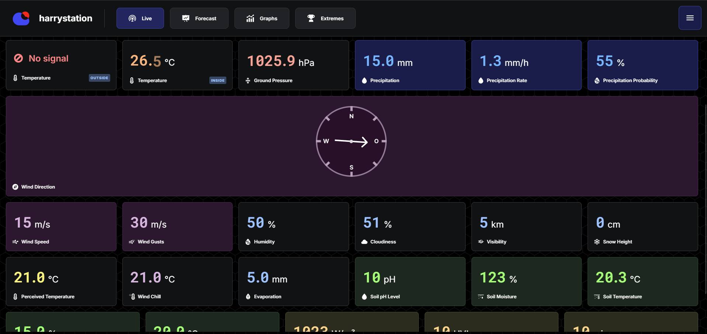

# Create your own weather control center, for free!

**open weather vision** (_owvision_ in short) is a _software system_ that allows you to

-   record
-   archive
-   analyze

and

-   share

the weather data of your _personal weather station(s)_. It is a self-hostable, open source solution. You only need a Raspberry Pi visible in your network (or in the whole world😉) to get started!

**[To get started read the official documentation!](https://open-weather-vision.github.io/docs/)**

## About this repository

The software contained in this repository is the basic building block (the _core_) of the _open weather vision software system_.

The core is responsible for the storage of the weather data (e.g. history records, forecasts, ranking records, ...) in a database and provides a RESTful API that offers an authenticated way to control the entire system (e.g. create a new weather station, read a sensor, ...).

This does not include the [recorder](https://github.com/open-weather-vision/recorder) - the software that is responsible for communicating with a weather station via an _interface_ and pushing realtime weather data to the _core_.

It also does not include any [command line interface](https://github.com/open-weather-vision/cli) or [graphical user interface](https://github.com/open-weather-vision/gui) to interact with _owvision_.
